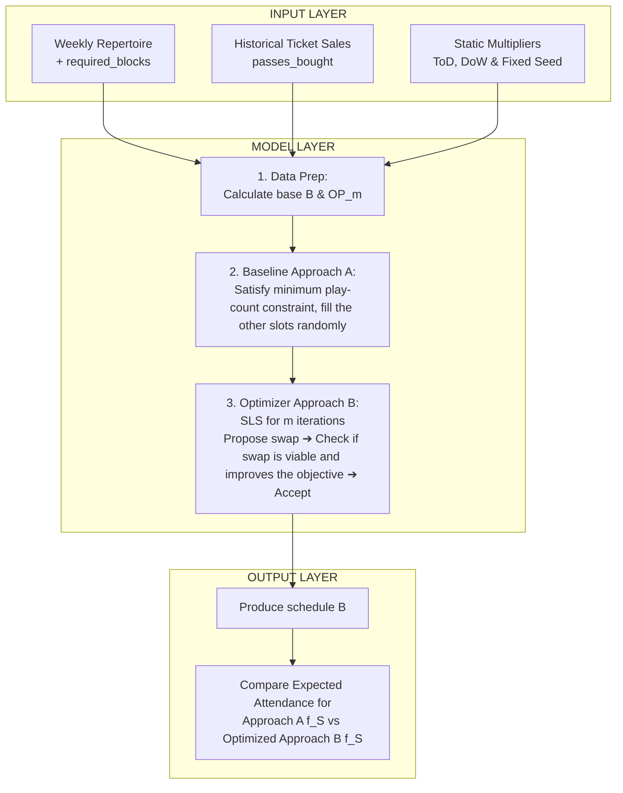

## 1. Decision, Scope & Problem Structure

A fictional cinema operator has several cinemas, a weekly movie repertoire and 7 working days each week available for screenings. The current operating practice for movie programming is unknown. The company database volume is vague, with only the structure being certain. Parameters like: time-of-day factor, day-of-week multiplier, overtime popularity are invented in Section 2. 

> Every week, the respective film programmer for each cinema uses the weekly repertoire, historical ticket sales, and available daily time blocks to assign movies to specific screening rooms and timeslots one week in advance, aiming to maximize the total number of visitors.

**Boundaries:** Each schedule is created for only one specific week. `[ASSUMPTION]` A single schedule week lasts from Friday to next Thursday.`[ASSUMPTION]` If a movie is listed in the repertoire it has to be played at least once in that week. `[ASSUMPTION]` Each cinema in the chain follows a strict business hours schedule throughout the week - 10:00-22:00, where the opening and closing hour each mark the earliest and latest time a movie can begin. `[ASSUMPTION]` Each day is divided into 2-hour-long blocks and a movie can either take up one or two consecutive blocks. `[ASSUMPTION]` The same movie can be shown in multiple rooms at the same time. `[ASSUMPTION]` All screening rooms across the chain share a single, standardized seating capacity of 100.

**Exclusions:** A set schedule cannot be altered once it has been accepted and the week it is referencing has begun. Pricing is never dynamic. Seat capacity cannot vary, neither across rooms, nor across cinemas.

**Decision `movie-schedule`:** choose which movies get played, when, and in which screening rooms for a single cinema. The decision is carried out by the respective movie programmer, who reviews and approves the generated weekly plan. The decision is supported by a Stochastic Local Search optimization that grades each movie-slot combination based on expected visitor counts to maximize total attendance.

| Object | Property | Classification (or unresolved status) | Structural evidence or question to resolve |
|---|---|---|---|
| Decision dependency graph | Decision Structure | Flat | One holistic decision to approve the weekly schedule; no parent–child or cascading dependencies |
| `movie-schedule` | State Structure | Stateless | Each weekly schedule is generated independently. No state or carryover is transferred between decisions |
| `movie-schedule` | Information Structure | Open-loop | We do not receive feedback after the decision is made. The actual ticketsales data arrives AFTER the week is finished. This is the direct effect of the problem design decision. |

The movie programmer may generate new schedules if he is unsatisfied with the initial outcome, before making the final approval decision.

## 2. Computable Problem

**Inputs, Outputs & Variables:** 
The proposed input contract requires: a weekly movie repertoire with a fictional `required_blocks` attribute (integer 1 or 2), static `time-of-day` and `day-of-week` dictionaries, and a historical dataset with information on `passes_bought` from the past 4 weeks. The output is the `movie-schedule` – a mapped assignment of movies to specific 2-hour blocks (from 10:00 to 22:00) across available screening rooms. The domain of time is discrete blocks. The unit of expected capacity is integer seats.

**Objective:** 
The primary objective is to maximize $f(M)$, measured in total expected visitors in a single week. It is crucial to distinguish this computed metric from the actual business outcome: the algorithmic score is a heuristic expectation based on historical momentum, not a financial guarantee of ticket revenue. It does not account for external anomalies.

**Constraints & Error Handling:** 
Both `repertoire-rule` (minimum one screening per listed movie) and `block-contiguity` (strict business operating hours window and contiguous block allocation for long movies) are hard constraints. Invalid inputs – such as a movie without a defined block length, or an attempt to schedule a 2-block movie starting at 22:00 – will block execution and return a validation error. Missing historical data is handled gracefully by defaulting the retention multiplier to 1.0, allowing execution to proceed. 

| Component ID | Decision ID | Role: Cost / Constraint / State-transition | Model: Formulation / Simulation / Data-driven | Definition, units, and evidence / assumption / unknown |
|---|---|---|---|---|
| `expected-attendance` | `movie-schedule` | Cost | Formulation | Maximize $f(M) = \sum \min(B \times ToD_t \times DoW_t \times OP_m, 100)$ in expected total visitors. Expected value is capped at 100 seats per screening. |
| `historical-parameters` | `movie-schedule` | Cost | Data-driven | Calculates neutral base $B$ and overtime popularity $OP_m$ using the past 4 weeks of `passes_bought` records. `[ASSUMPTION]` Missing history defaults $OP_m$ to 1.0 or utilizes the global average. |
| `repertoire-rule` | `movie-schedule` | Constraint | Formulation | Hard rule: Every movie listed in the weekly repertoire must be scheduled at least once. |
| `block-contiguity` | `movie-schedule` | Constraint | Formulation | Hard rule: Screenings must fit within the 10:00–22:00 operating window. `[ASSUMPTION]` A movie occupies either 1 or 2 consecutive 2-hour blocks in a single room. |

**Follow-up Questions (Classification Reference):** 
*   *State-transition model / Observation timing:* N/A — As classified in Section 1, this problem is bounded as `Stateless` and `Open-loop`. There is no state passed between weekly scheduling epochs within the system boundary, and no dynamic observations are injected into the schedule once it is set.

## 3. Information & Uncertainty
One record represents one completed ticket purchase (1 or more) for a specific screening at one of the branches. The unit of analysis for the decision model is the aggregate screening. To establish the baseline ($B$) and overtime popularity trend ($OP_m$), the raw purchase records must be aggregated by `title_tag`, `venue_tag`, `play_day`, and `curtain_time` to calculate the total `passes_bought` per screening. At the time of decision, only historical sales data is available. The actual outcome is collected in the future, for further evaluation purposes.

| Fact / assumption / unknown or request | Evidence or reason for current treatment | Why it matters | How to confirm or obtain it; priority | Fallback or limit until confirmed |
|---|---|---|---|---|
| `[ASSUMPTION]` Standard 100-seat capacity across all screening rooms | The dataset provides `venue_tag` but lacks screening room IDs or capacity limits. | It caps the `expected-attendance` calculation to prevent physically impossible scheduling results. | Request a layout mapping seating capacities for all rooms per venue; high. | Retain the 100-seat cap; limit claims to a simplified feasibility demonstration. |
| `[ASSUMPTION]` Movies fit into standardized 1 or 2 discrete 2-hour blocks | `title_tag` is a text label with no associated runtime or duration. `curtain_time` alone does not provide information about the length of a movie | Long movies require contiguous blocks; failing to account for this breaks the operational schedule. | Request actual movie runtimes in minutes from the distributor catalog; high. | Use an invented `required_blocks` attribute for the fictional demonstration data. |
| **Fact:** No financial or pricing data | The specification tracks `passes_bought` without monetary values. | Maximizing visitors does not necessarily maximize profit if ticket prices or distributor cuts vary by movie. | Request clarification on business goals and ticket pricing structures; medium. | Limit the stated objective strictly to visitor maximization. |
| **Fact:** Records show completed purchases only | As stated in the information received from the company: One row represents one completed purchase. | The data does not capture unfulfilled demand. | Request website logs or box-office records of failed purchase attempts; low. | Treat historical `passes_bought` as the absolute demand ceiling, capped by the room capacity. |

The primary uncertainty stems from the static `time-of-day` and `day-of-week` multipliers, which are currently defined as heuristic assumptions rather than statistically validated models. To examine their effect, a sensitivity check will be performed during evaluation: modifying a multiplier (e.g., heavily penalizing Friday evenings) should visibly force the SLS algorithm to reallocate popular movies to different slots. 

The recommendation system should be revised and/or stopped from shipping if further investigation of facts unveils new strict constraints, such as: equipment limits (IMAX projectors in specific rooms) or contractual demands (e.g. blockbuster premieres are mandatory to be played in the best timed spots) or other information disrupting the core logic of the model.

## 4. Alternatives & Selected Approach

| Approach | Mechanism and required information | Strengths, limitations, and effort | Selection and reason |
|---|---|---|---|
| A: Baseline = constraint-first approach + random selection for remaining slots | 1. Assign each movie from the repertoire to one available slot beginning from the worst multiplier of ToD and DoW to satisfy the constraint. 2. Fill all remaining slots randomly. Requires only the repertoire list and available grid. | **Strengths:** One pass, extremely fast, trivial to implement. **Limitations:** Completely ignores historical data and capacity optimization; highly likely to produce poor attendance. **Effort:** Low. | Reference baseline to demonstrate the value of optimization in the actual undertaken process |
| B: Baseline + Stochastic Local Search | 1. Initialize by implementing steps from Approach A  2. Iteratively evaluate valid swaps (matching block lengths: 1:1 or 2:2)  3. Accept swap if it increases $f(S)$ and the swapped-out movie maintains `count >= 1`.  Requires $ToD$, $DoW$, $OP_m$, and reproducible randomness (single seed).| **Strengths:** Effectively navigates hard constraints while improving expected attendance; mathematically simple to evaluate. **Limitations:** May get stuck in local optima; more iterations may or may not mean better results. No certainty about the solution being truly optimal (heuristic) **Effort:** Medium. | Chosen approach for the interactive HTML demonstration. It provides a checkable mechanism balancing constraint satisfaction with value maximization. |

The process can be summarized by the following graph:

